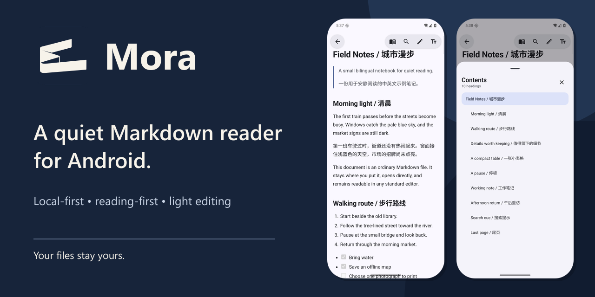
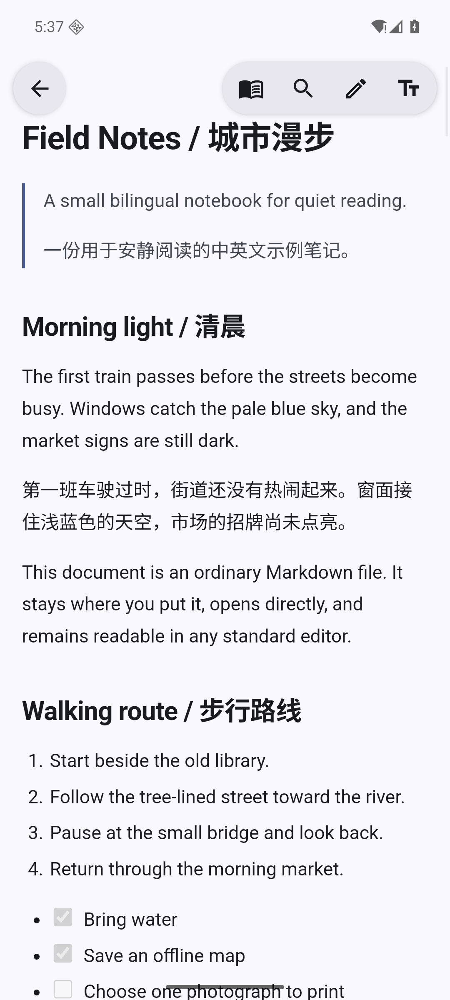
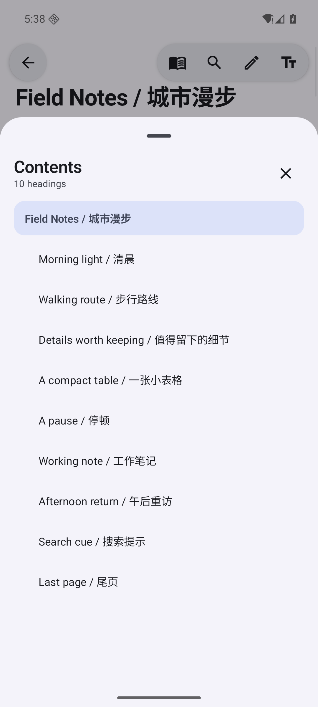
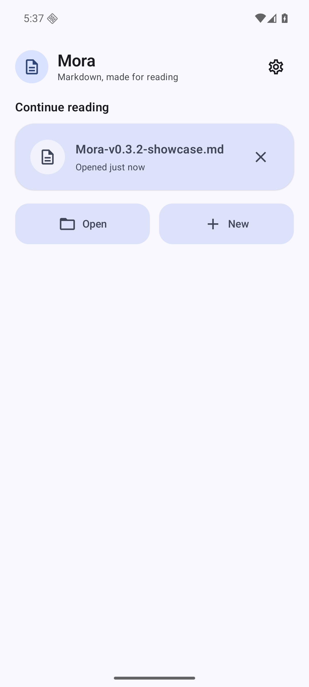

# Mora

**A quiet, local-first Markdown reader for Android, with just enough editing when you need it.**

[简体中文](README.zh-CN.md)

**[Download the latest release](https://github.com/bjcdeshu/mora-markdown/releases/latest)** · Android 8.0+ · [Feedback](https://github.com/bjcdeshu/mora-markdown/issues/15) · [Report a bug](https://github.com/bjcdeshu/mora-markdown/issues/new?template=bug_report.yml) · [LINUX DO](https://linux.do/)



## Download

Every stable release includes a signed APK and a matching SHA-256 sidecar. Pre-releases are test candidates; the **Latest** release has passed Mora's exact-asset release gate.

## Made for one document at a time

- Open standard Markdown files from Android's file picker or another app, then resume from recent documents.
- Read with tuned typography, a quiet progress indicator, restored reading position, and adjustable font size, line height, and margins.
- Navigate long documents with an H1–H3 table of contents, current-section highlighting, and in-document search.
- Make light source edits with a mobile formatting bar, then save in place; Save As appears only when a new target or writable copy is required.
- Follow the device language and appearance, with English and Simplified Chinese UI, light/dark modes, dynamic color, and three launcher palettes.

## Screenshots

| Reader | Table of contents | Home |
|:--:|:--:|:--:|
|  |  |  |

## Local-first by design

Mora works with ordinary Markdown files through Android's Storage Access Framework. There is no account, proprietary document format, telemetry, or built-in cloud service. Your storage provider controls where a document lives; Mora keeps the document under your control.

Markdown raw HTML is escaped, unsafe URLs are sanitized, and the reader WebView does not expose a JavaScript bridge or local-file access. Remote images referenced by a document may still contact their host when rendered. See [Privacy](PRIVACY.md) and [Security](SECURITY.md) for the complete boundaries.

## What Mora is not

Mora is not a vault or knowledge workspace. Backlinks, graph views, accounts, built-in cloud sync, and a plugin ecosystem are outside the current product scope.

## Build from source

Requirements:

- JDK 17 or newer (Android Studio's bundled runtime is supported)
- Android SDK 36
- Android Studio compatible with Android Gradle Plugin 9.3

Use the checked-in Gradle Wrapper:

```bash
./gradlew testDebugUnitTest lintDebug assembleDebug
```

On Windows:

```powershell
.\gradlew.bat testDebugUnitTest lintDebug assembleDebug
```

The Debug APK is written to `app/build/outputs/apk/debug/app-debug.apk`.

## Contributing

Focused bug reports and improvements are welcome. Read [CONTRIBUTING.md](CONTRIBUTING.md) before proposing a large change. Current direction is recorded in [ROADMAP.md](ROADMAP.md), release history in [CHANGELOG.md](CHANGELOG.md), and the signed-release process in [docs/RELEASING.md](docs/RELEASING.md).

## License

Mora is available under the [MIT License](LICENSE).
